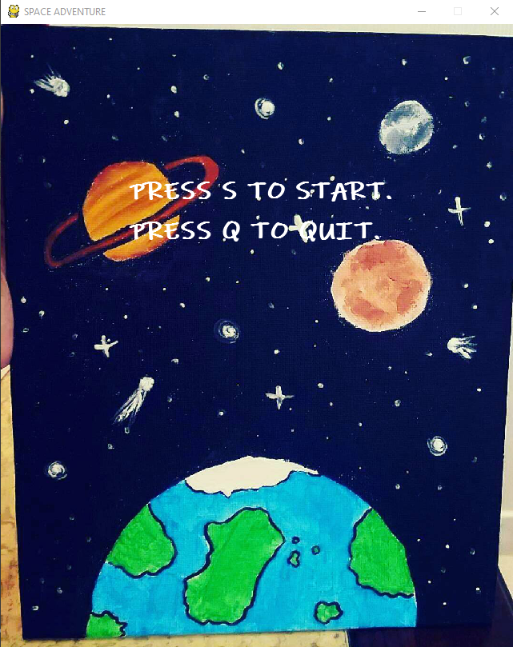
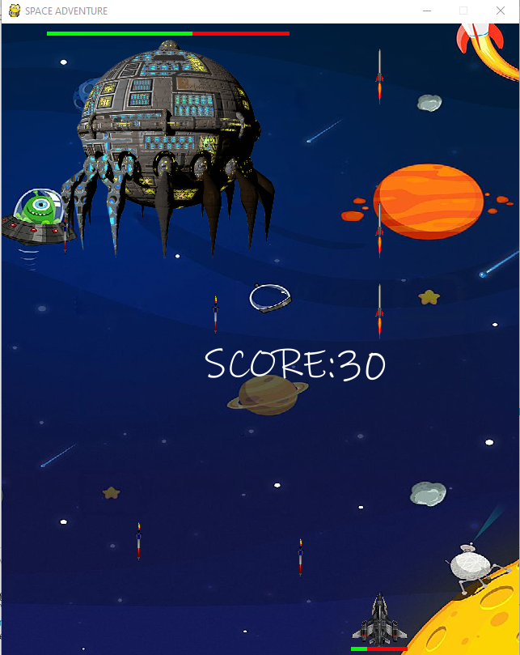
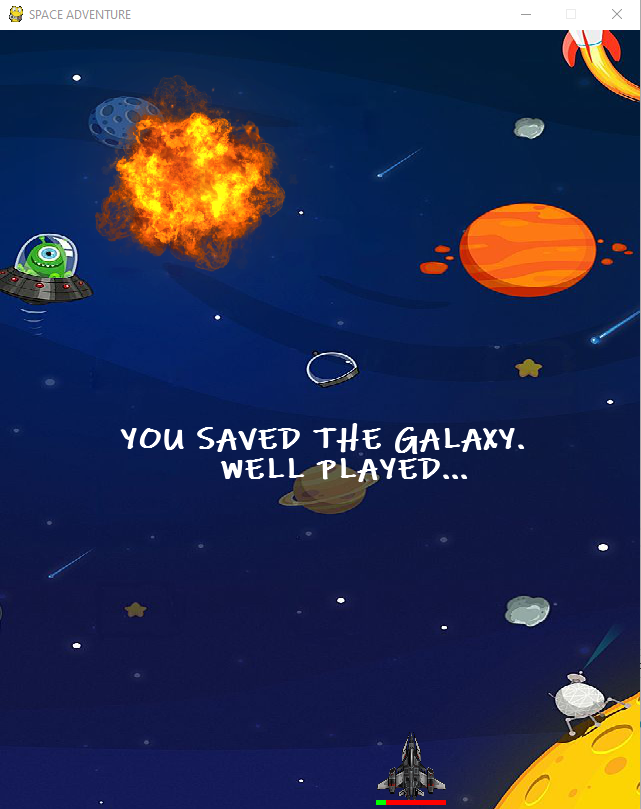
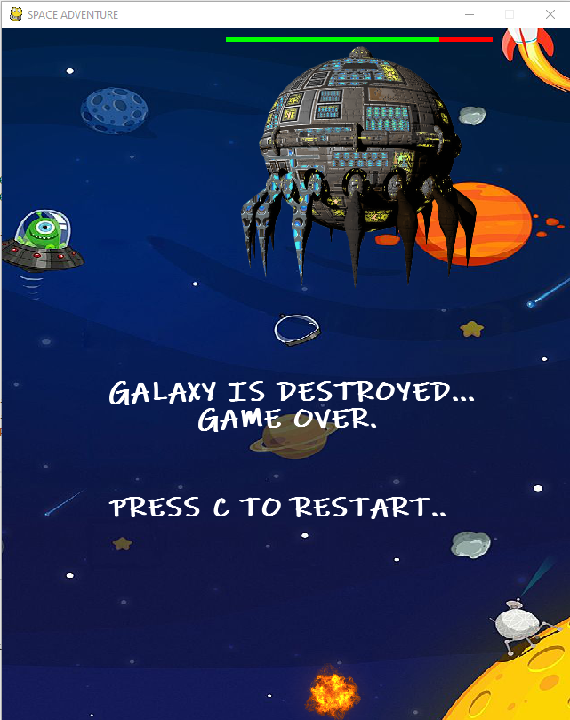
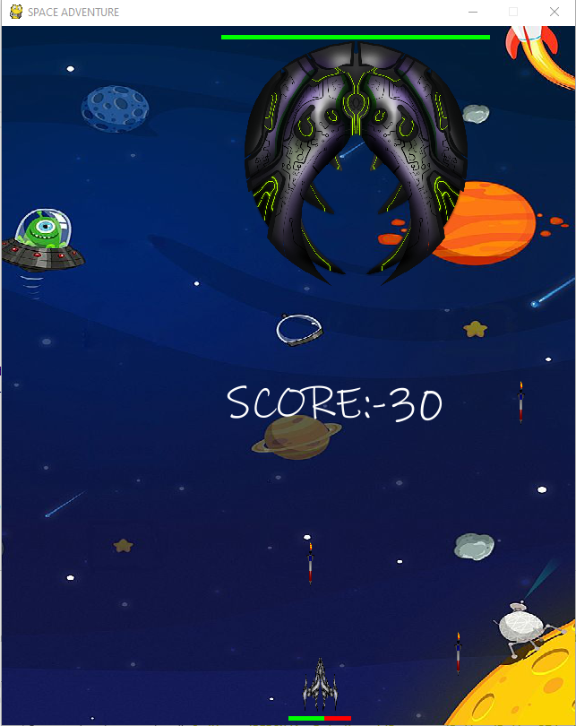

# SpaceGame

This is a simple Space-Game that I created using Pygame Module in python in about 24hr (18/March/2019 - 19/March/2019) just for self-lerning purpose.

# Disclaimer

I made this game a year ago (today: 25/July/2020). So I don't have a reference or knowledge about who create all the Graphic images in the game. I had just downloaded those from Internet. So if you made any of them and want them removed just Contact Me.

# Screenshots of Game

## This game has two screens

1. **For the Main Menu to start or quit the game**  
    

2. **For the Actual game that you can play**
    1. Screen for main game  
      
    2. Screen for when game is won  
      
    3. Screen for when game is lost  
      

# Game Variants

1. This the First Game variant  
    
1. This the Second Game variant  
    
